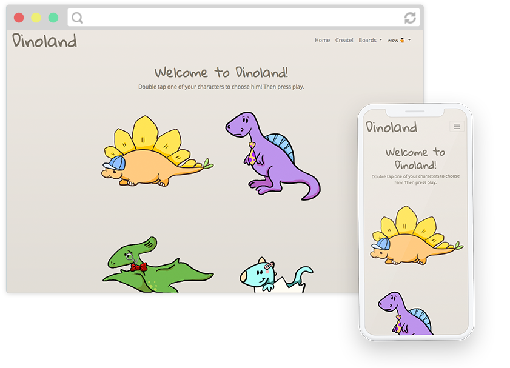
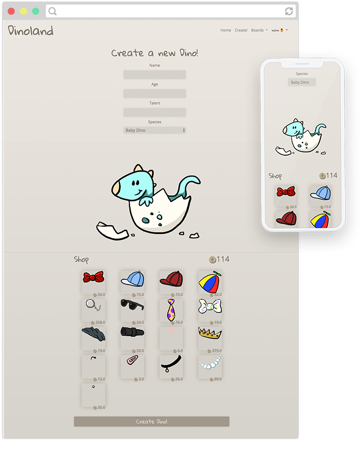
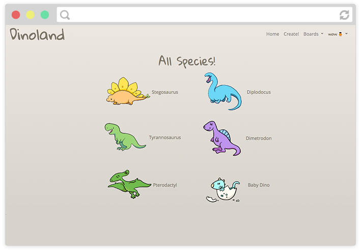
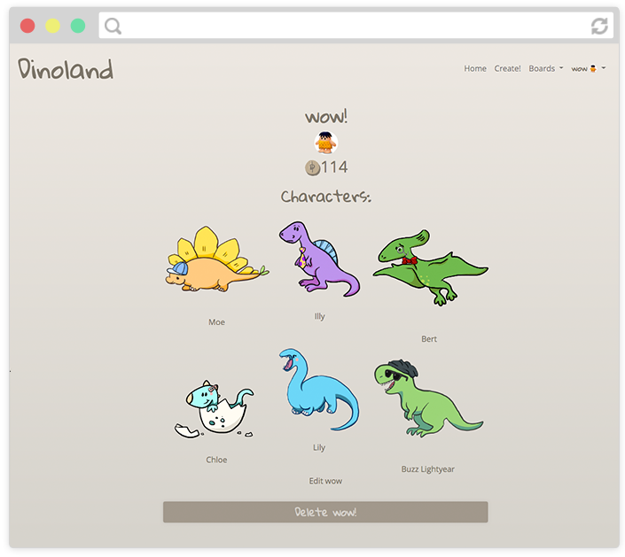

# DinoLand!

DinoLand is a platform where users can create a collection of their own dinosaur characters, and dress them up in a variety of accessories!

With your fresh new characters, play the in built game to earn more coins, so you can change up their fresh looks!

DinoLand can be found [here](https://dinoland-project.herokuapp.com/)

## Getting Started

Click on the link above to visit the site, then create a new user (or log in if you are a returning user).

No additional software required, only a good attitude and some creativity!

## Built with

- jQuery - for the js
- jQuery UI - and the draggable elements.
- Rails - for the backend
- Bootstrap - for the responsive menu bar
- Cloudinary - image hosting
- Heroku - hosting

## Features

- Create an account
- Create some characters
- Play the game with your selected character to earn dino coins!
- Give your characters Posessions from the Accessory list using the dino coins you have earned
- Browse other User's profile pages, to see what Characters (or species, or accessories!) they have made.

- Creator Account:
  - Some users can apply to be creators.
  - A creator account is able to contribute to the platform by creating species and accessories for the community to use!

- Delete your characters or your own account.

- Game Coming Soon.

## Screenshot

*Home Page*

*Create a Character*

*Species List*

*User Profile Page*

## Acknowledgments

Special thanks to [Amy Buchan](www.amybuchan.com) for contributing to the species and accessory art, and also for general enthusiasm for dinosaurs.

## Knows Issues

- Not mobile compatible for creating and editing dinosaurs.
